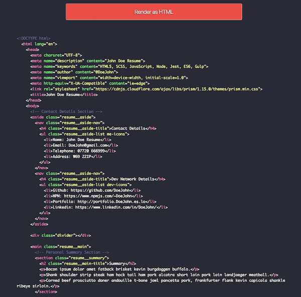
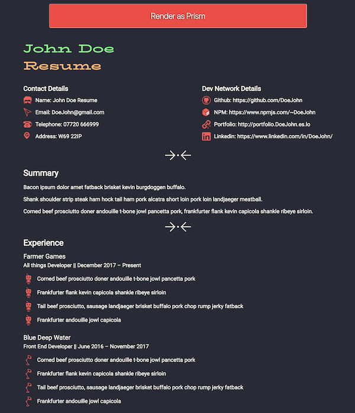

# Curriculum Web Template

With this package you can create a Curriculum/Resume as a web page. It has two flavours, one that uses [Prismjs](https://prismjs.com/) (a syntax higlighter) and the other one that is the HTML rendered.

It uses webpack to build your html file that it can be found at `./dist/index.html`